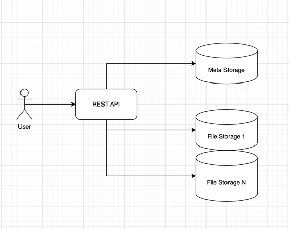

# Basic S3

Простая реализация S3-подобного сервиса для загрузки/скачивания файлов

## Запуск приложения

Поднять окружение
```
docker compose up
```

Запустить функциональные [тесты](tests/api_test.go)
```
make func-tests
```

Также можно потестировать вручную с помощью curl. Примеры:
- [Загрузка файла](examples/upload.sh)
- [Скачивание файла](examples/download.sh)

## Высокоуровневая схема



### Компоненты

Сервис состоит из 3 компонентов:

* **REST API** - обработка входящих запросов пользователей
* **Meta Storage** - хранение мета-информации о файлах
* **File Storage** - хранение партов файлов

#### REST API

[Swagger](api/public-api.yaml)

В качестве http роутера используется Fiber.

#### MetaStorage

[Интерфейс](internal/rest/meta/types.go) 

Для простоты реализован в виде inmemory хранилища - map + RWMutex (без шардирования, бакетов и т.п.).
Для сохранения стейта между рестартами приложения для MetaStorage реализовано простое сохранение/загрузка 
его состояния в файл/из файла.

(В реальности в качестве MetaStorage должно быть какое-то шардированное хранилище)

#### FileStorage

gRPC-сервер для работы с файлами. Передает файлы по стриму.

[Протокол](proto/storage.proto)

gRPC выбран за его простоту и кодогенерацию кода клиента/сервера.

#### Другие компоненты

В рамках тестового задания другие компоненты не прорабатывались. Но вполне желательно иметь еще кеш для "горячих" данных.

### Основные сущности

#### File

File -> имя бакета + ключ

#### FileVersion

Каждая загрузка создает новую версию файла FileVersion -> версия, статус и массив партов.
Статус при начале загрузки Loading. По окончании загрузки статус меняется на Error или Ready.

Скачать можно только файл со статусом Ready.

В рамках тестового задания не было реализовано никакого "фонового" процесса по очистке не до конца загруженных файлов,
а также, например, чистке старых версий файлов.

#### Part

Состоит из номера парта и массива серверов, на который данный парт был загружен.

Для простоты каждый парт грузится только на 1 файловый сервер. Но можно сделать настройку, например,  
Replication Factor для репликации файла на несколько серверов.

#### PartDistributor

Отвечает за план распределения партов файлов по серверам при загрузке файла. 
Для каждого сервера задан вес. Чем больше вес, тем чаще он будет задействован при загрузке файлов.

Также конфигурируется еще 2 параметрами:
* минимальный размер парта
* максимальное число партов

К примеру, если минимальный размер парта 8Kb, а размер файла 15Kb - то он будет поделен всего лишь на 2 парта.

В рамках тестового задания не было реализовано никакого хранения стейта текущих серверов. В реальности алгоритм должен 
учитывать и этот, и многие другие факторы.

Добавление новых серверов можно обыграть заданием для них повышенных весов. В данный момент приложение не поддерживает 
динамическое добавление серверов (требуется перезапуск с обновленными настройками). В реальности эти данные можно как-то
дискаверить.

#### Orchestrator

Координирует работу всех логических компонентов в REST API.

При загрузке файла:
- получает план загрузки от PartDistributor
- создает новую версию файла в Meta Storage
- последовательно читает чанками файл, распределяя парты серверам из полученного плана. По готовности парта создает 
запись в Meta Storage
- По окончании загрузки помечает FileVersion как Ready в случае успеха, или Error в случае ошибки.

При скачивании файла:
- получает список партов (при условии существования файла)
- последовательно загружает парт за партом и чанками отправляет прочитанную информацию клиенту

В случае ошибки - оркестратор прерывает процесс загрузки/скачивания файлов - в данный момент нет никаких ретраев. 
В случае прерывания загрузки пользователем - запрос тоже завершается за счет использования контекста.

### Конфигурация приложения

Полностью осуществляется за счет переменных окружения

- [Конфиг REST](internal/rest/config/config.go)
- [Конфиг FileStorage](internal/storage/config/config.go)

### Тестирование

Пример табличных unit тестов можно посмотреть [тут](internal/rest/meta/inmemory/inmemory_test.go).
Полностью покрыт тестами метод GetVersion. 

Другой код тестировался только в рамках функциональных тестов и в теории может содержать баги, которые не были
замечены в ходе тестов.

## PS

В рамках тестового задания был реализован PoC и не рассматривались вопросы:
- авторизации
- разграничении доступов
- рейт-лимитов
- ограничения скорости
- кеширования
- High Availability
- метрик
и др.
